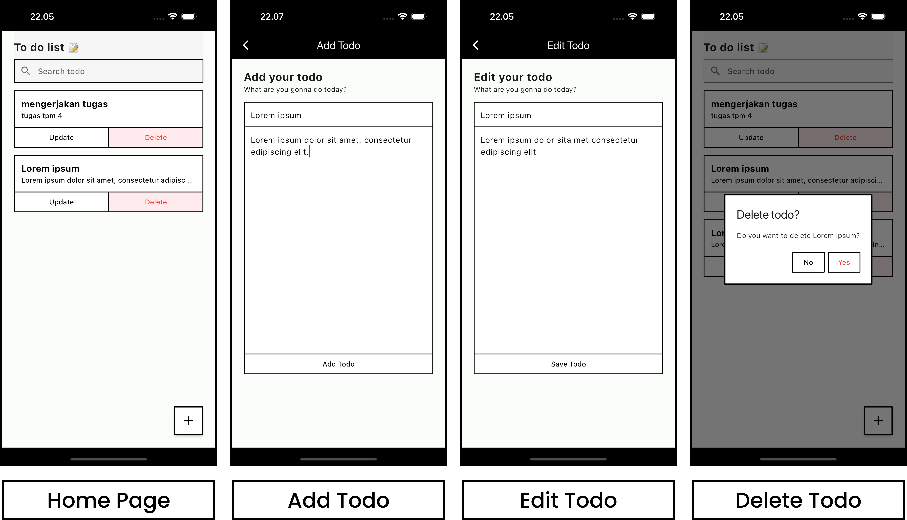

# prak_tcc_fe_mobile

Implementasi (Front-End) dari web service yang telah dibuat pada repository berikut.

[Web Service Todo List](https://github.com/plirapli/asisten-prak-tcc-7-api)

## How to start

1. Nyalakan web service yang terdapat pada [repository ini](https://github.com/plirapli/asisten-prak-tcc-7-api).
2. Jalankan project flutter (`flutter run`)
3. 🏃🏻‍♂️

## Screenshot &nbsp; 📸

